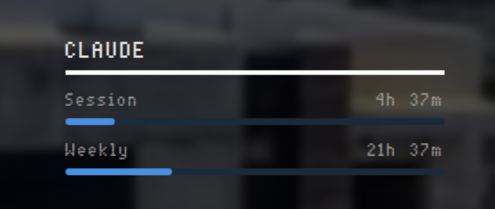

# MMM-AnthropicUsage

A [MagicMirror²](https://github.com/MichMich/MagicMirror) module that displays your [Claude.ai](https://claude.ai) Pro plan usage — current session, weekly limits, and extra credit spend — with animated progress bars.



## Features

- **Session usage** — current 5-hour rolling window utilization and time until reset
- **Weekly usage** — 7-day rolling window utilization and time until reset
- **Extra credits** — spend vs. monthly limit (shown only when enabled on your account)
- **Auto-refreshing session key** — captures the refreshed `sessionKey` from each API response so you only need to paste it once
- **Configurable colors** — bar, track, warn, and over-limit colors all customizable

## Installation

```bash
cd ~/MagicMirror/modules
git clone https://github.com/YOUR_USERNAME/MMM-AnthropicUsage
```

No npm dependencies — uses only Node.js built-ins.

## Getting your credentials

You need two values from your browser while logged into claude.ai:

**`orgId`** — your organization ID  
**`sessionKey`** — your session cookie

1. Open [claude.ai](https://claude.ai) and log in
2. Open DevTools → Network tab
3. Navigate to **Settings → Usage** (or any page that loads)
4. Find a request to `claude.ai/api/organizations/...` and copy the org ID from the URL
5. In the request headers, find the `Cookie` header and copy the value of `sessionKey=...`

> The module automatically refreshes the session key on every API call, so you should only need to do this once.

## Configuration

Add to your `config/config.js`:

```javascript
{
    module: "MMM-AnthropicUsage",
    position: "bottom_left",
    header: "Claude",
    config: {
        sessionKey: "YOUR_SESSION_KEY",
        orgId: "YOUR_ORG_ID",
    }
}
```

### All options

| Option | Default | Description |
|--------|---------|-------------|
| `sessionKey` | `null` | **Required.** Your claude.ai session cookie value |
| `orgId` | `null` | **Required.** Your claude.ai organization ID |
| `updateInterval` | `120` | Seconds between data refreshes |
| `initialLoadDelay` | `0` | Seconds to wait before first fetch |
| `animationSpeed` | `0` | DOM update animation speed in ms |
| `fontSize` | `"small"` | Font size: `x-small`, `small`, `medium`, `large`, `x-large` |
| `showExtra` | `false` | Show the extra credits row (for accounts with usage-based billing enabled) |
| `barColor` | `"#4a90e2"` | Progress bar fill color |
| `trackColor` | `"#1a2a3a"` | Progress bar track (background) color |
| `warnColor` | `"#e2a94a"` | Bar color when usage ≥ 80% |
| `overColor` | `"#cc3318"` | Bar color when usage = 100% |

## How it works

The module calls the internal claude.ai usage API (`/api/organizations/{orgId}/usage`) using your session cookie for authentication. Every response includes a refreshed `sessionKey` in the `Set-Cookie` header, which the module saves to `.session.json` so the key stays current automatically.

## License

MIT
